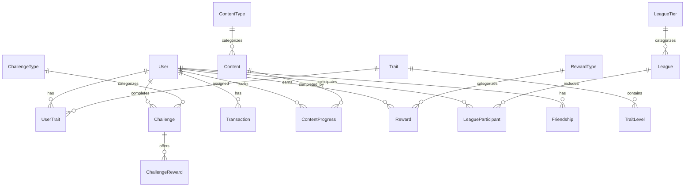
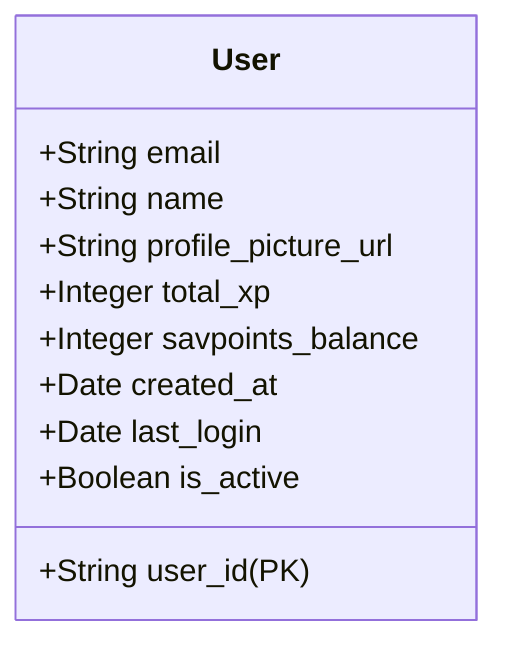
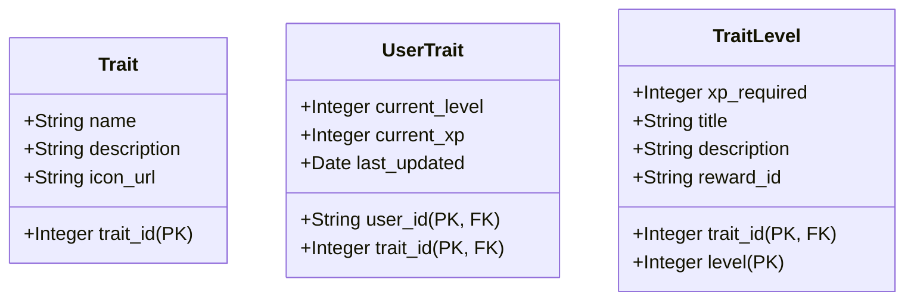
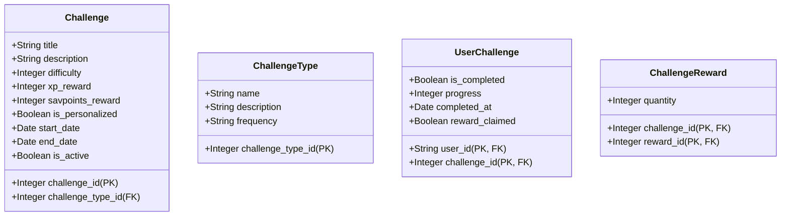
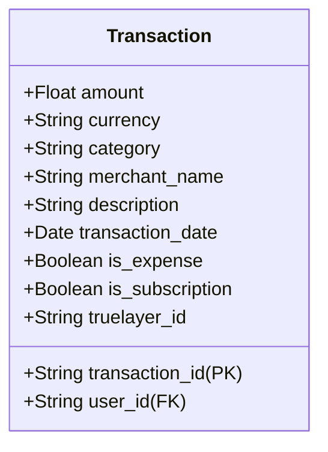
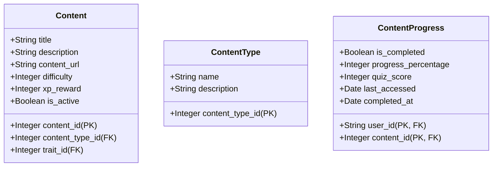
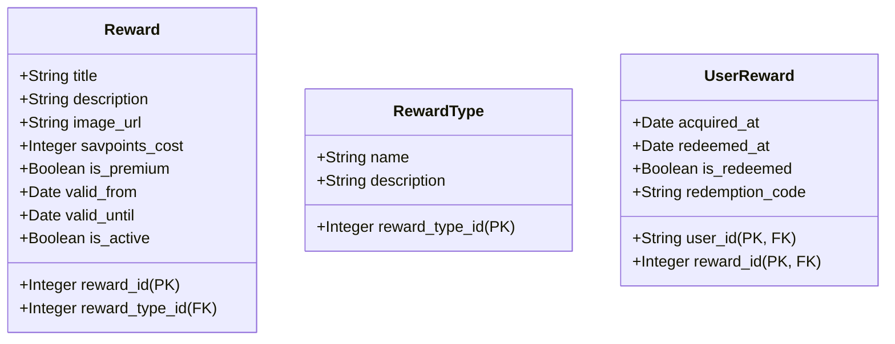
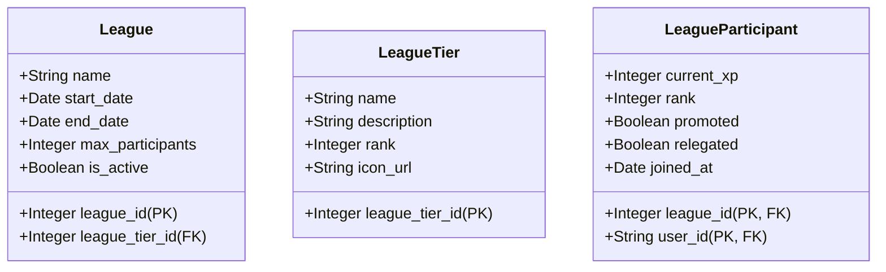
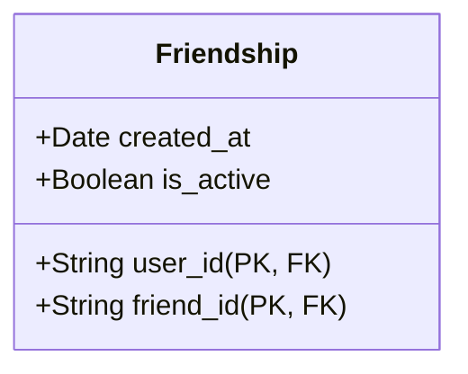
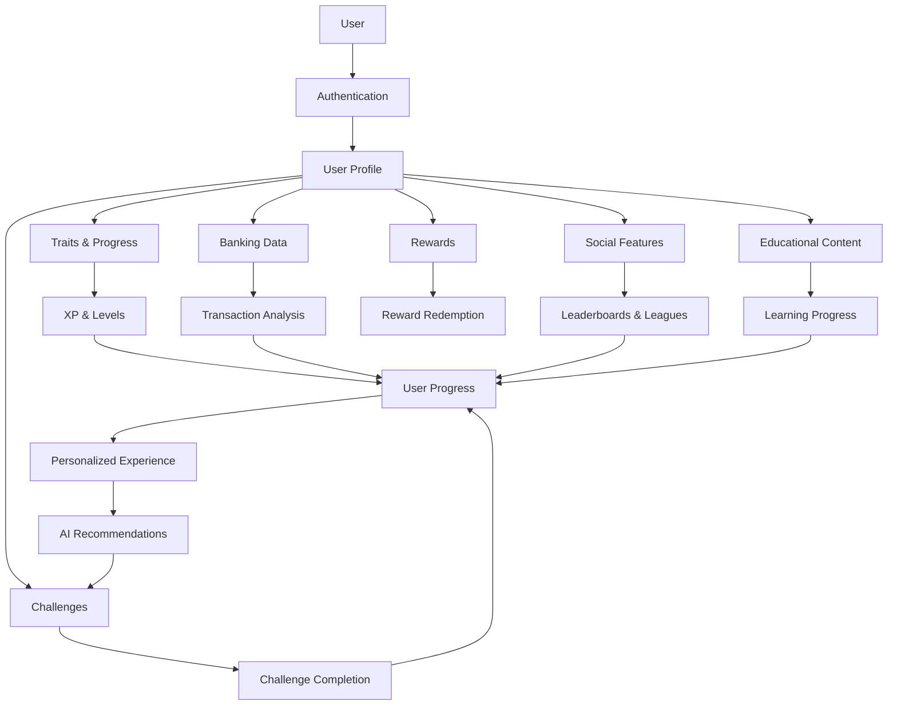

# SavQuest Database Schema

This document outlines the database structure for SavQuest, a gamified financial literacy application.

## Entity Relationship Diagram



## Tables

### User


### Trait


### Challenge


### Transaction


### Content


### Reward


### League


### Friendship


## Data Flow



## Notes on Implementation

### For Hackathon MVP:
1. **Focus Areas:**
   - User, UserTrait, and Trait tables are essential
   - Challenge system for basic gamification
   - Mock transaction data instead of full TrueLayer integration
   - Basic content for financial literacy quizzes

2. **Simplified Tables:**
   - Consider combining some related tables for the MVP
   - Use mock data for leagues and friendships
   - Implement basic reward structure

3. **Data Storage:**
   - Use AWS DynamoDB for flexible schema during development
   - Consider migration path to relational database for production

### Future Considerations:
1. **Scaling:**
   - Plan for partitioning of transaction data as it grows
   - Consider caching strategies for leaderboard and frequently accessed data

2. **Analytics:**
   - Add tables for tracking user engagement metrics
   - Implement data warehouse structure for analytics

3. **Performance:**
   - Add indexes on frequently queried fields
   - Consider read replicas for leaderboard and social features
``` 