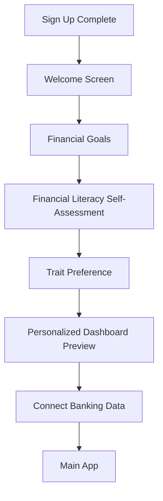

# SavQuest Onboarding Sequence

This document outlines the user onboarding flow for SavQuest, designed to collect essential information while engaging users from the start of their financial literacy journey.

## Onboarding Flow Overview

## Screen Details

### 1. Welcome Screen
**Purpose:** Create an emotional connection and set expectations

**Components:**
- Animated rocket ship progress indicator (1/6 complete)
- Welcoming headline: "Welcome to Your Financial Journey!"
- Subheading: "You've taken the first step toward financial mastery"
- Brief value proposition: "SavQuest turns financial learning into a game where you'll earn rewards while building real-world skills"
- "Let's Get Started" button

**Design Notes:**
- Warm, encouraging tone
- Celebratory visual elements
- Minimal text to avoid overwhelming

### 2. Financial Goals Selection
**Purpose:** Understand user motivation and personalize future challenges

**Components:**
- Progress indicator (2/6 complete)
- Headline: "What brings you to SavQuest?"
- Interactive carousel with goal options:
  - Saving for a home
  - Reducing debt
  - Building emergency fund
  - Becoming more financially literate
  - Investing for the future
  - Other (with optional text input)
- Multi-select functionality (choose up to 3)
- "Continue" button

**Design Notes:**
- Visual icons for each goal
- Brief description under each option
- Subtle animations on selection

### 3. Financial Literacy Self-Assessment
**Purpose:** Gauge current knowledge level for appropriate content difficulty

**Components:**
- Progress indicator (3/6 complete)
- Headline: "How would you rate your financial knowledge?"
- Interactive slider with fun labels:
  - "Financial Rookie" (1)
  - "Budget Beginner" (2)
  - "Money Manager" (3)
  - "Finance Enthusiast" (4)
  - "Wealth Wizard" (5)
- Brief, encouraging message: "No matter where you start, SavQuest will help you level up!"
- "Continue" button

**Design Notes:**
- Playful illustrations for each level
- Non-judgmental, positive framing
- Slider interaction with visual feedback

### 4. Trait Preference
**Purpose:** Identify which financial traits to emphasize initially

**Components:**
- Progress indicator (4/6 complete)
- Headline: "Which financial superpower would you like to develop first?"
- Card selection for each trait:
  - **Saver** - Master saving techniques
  - **Investor** - Learn wealth-building strategies
  - **Budgeter** - Develop expense management skills
  - **Financial Scholar** - Build financial knowledge
- Brief description of each trait
- "Continue" button

**Design Notes:**
- Character illustrations for each trait
- Cards highlight on hover/selection
- Primary trait selection with option to rank others

### 5. Personalized Dashboard Preview
**Purpose:** Show value and build excitement

**Components:**
- Progress indicator (5/6 complete)
- Headline: "Here's a preview of your financial journey"
- Animated mockup of dashboard with:
  - Selected trait prominently featured
  - Sample challenges based on selected goals
  - XP progress visualization
  - Leaderboard preview with placeholder data
- "Looking good!" button

**Design Notes:**
- Partially blurred/mock data to indicate preview status
- Callouts highlighting key features
- Animated elements to create excitement

### 6. Connect Banking Data
**Purpose:** Prepare user for TrueLayer integration

**Components:**
- Progress indicator (6/6 complete)
- Headline: "One last step: Connect your banking data"
- Subheading: "SavQuest uses TrueLayer to securely access your financial information"
- Benefits of connecting:
  - Personalized challenges based on spending habits
  - Automatic tracking of financial progress
  - Smart insights to help you reach your goals faster
- "Connect Later" and "Connect Now" buttons
- Security reassurance: "Your data is encrypted and never shared with third parties"

**Design Notes:**
- Security badges/icons
- Clear explanation of data usage
- Option to skip for now

## Technical Implementation Notes

### State Management
- Store onboarding progress in local state
- Save completed information to user profile upon completion
- Allow resuming onboarding if interrupted

### Responsive Design
- Ensure all screens work on mobile, tablet, and desktop
- Adjust carousel and card layouts for smaller screens
- Consider touch-friendly interactions for mobile

### Accessibility
- Ensure all interactive elements are keyboard navigable
- Provide appropriate ARIA labels
- Maintain sufficient color contrast

### Data Collection
- Map collected information to user profile schema
- Store financial goals as array in user preferences
- Use self-assessment level to calibrate initial challenge difficulty

## Next Steps After Onboarding

1. If banking connection is skipped, prompt again after 3 days of app usage
2. Use collected data to generate first set of personalized challenges
3. Highlight the trait selected as primary focus in the main dashboard
4. Provide contextual tooltips for key features based on self-assessed knowledge level

## Mockup References

[Include links to design mockups when available] 