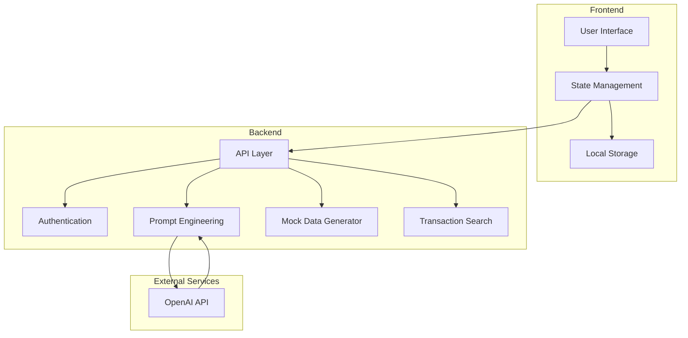
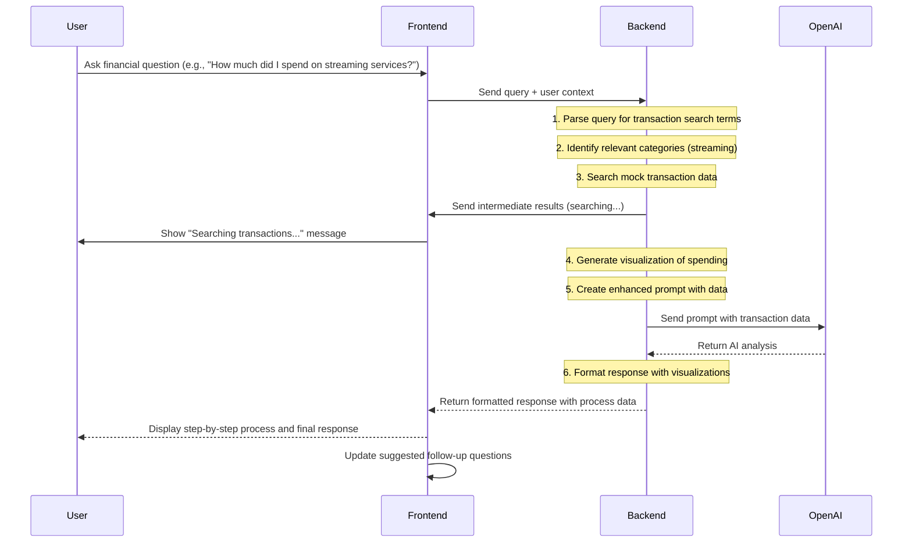
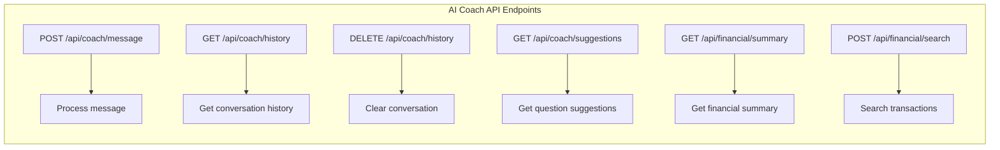

# AI Financial Coach Implementation Plan

## Overview

The AI Financial Coach is a personalized financial advisor that leverages user data and OpenAI's language models to provide tailored financial guidance, insights, and recommendations. This document outlines the implementation plan and architecture for this hackathon feature.

## Simplified System Architecture



## Data Flow with Process Visualization



## Backend Implementation

### 1. API Endpoints



### 2. Transaction Search Functionality

The system will include a specialized transaction search function that can:

1. Parse natural language queries for transaction-related keywords
2. Identify time periods mentioned in the query (e.g., "last 6 months")
3. Recognize specific merchants or categories (e.g., "Netflix", "streaming services")
4. Search the mock transaction database for matching entries
5. Aggregate and summarize the results
6. Visualize spending patterns when appropriate

```python
def search_transactions(query, user_id, mock_data):
    """
    Search transactions based on natural language query
    
    Example query: "How much did I spend on Hulu, Amazon Prime and Netflix the past 6 months?"
    """
    # Extract time period
    time_period = extract_time_period(query)  # Returns (start_date, end_date)
    
    # Extract merchants or categories
    merchants = extract_merchants(query)  # Returns ["Hulu", "Amazon Prime", "Netflix"]
    categories = extract_categories(query)  # Returns ["streaming", "entertainment"]
    
    # Search mock transaction data
    matching_transactions = []
    for transaction in mock_data.transactions:
        # Check if transaction is within time period
        if not (time_period[0] <= transaction.date <= time_period[1]):
            continue
            
        # Check if transaction matches merchants or categories
        merchant_match = any(m.lower() in transaction.merchant.lower() for m in merchants)
        category_match = transaction.category.lower() in [c.lower() for c in categories]
        
        if merchant_match or category_match:
            matching_transactions.append(transaction)
    
    # Aggregate results
    total_spent = sum(t.amount for t in matching_transactions)
    by_merchant = {}
    for t in matching_transactions:
        if t.merchant not in by_merchant:
            by_merchant[t.merchant] = 0
        by_merchant[t.merchant] += t.amount
    
    # Generate visualization data
    visualization = {
        "type": "pie_chart",
        "data": by_merchant,
        "total": total_spent,
        "period": f"{time_period[0].strftime('%b %Y')} to {time_period[1].strftime('%b %Y')}"
    }
    
    return {
        "transactions": matching_transactions,
        "summary": {
            "total_spent": total_spent,
            "by_merchant": by_merchant,
            "time_period": time_period
        },
        "visualization": visualization,
        "process_steps": [
            "Identified time period: past 6 months",
            f"Searched for merchants: {', '.join(merchants)}",
            f"Found {len(matching_transactions)} matching transactions",
            f"Total spent: ${total_spent:.2f}"
        ]
    }
```

### 3. Process Visualization in Chat

The chat interface will show the AI's thought process and data analysis steps:

```python
async def process_financial_query(query, user_id):
    # 1. Initial acknowledgment
    yield {
        "type": "process_step",
        "content": "Understanding your question about streaming service expenses..."
    }
    
    # 2. Transaction search
    yield {
        "type": "process_step",
        "content": "Searching your transaction history for streaming services..."
    }
    
    # 3. Perform the actual search
    search_results = search_transactions(query, user_id, mock_data)
    
    # 4. Show search results
    yield {
        "type": "search_results",
        "content": f"Found {len(search_results['transactions'])} transactions related to streaming services",
        "data": search_results["summary"]
    }
    
    # 5. Generate visualization
    if search_results["visualization"]:
        yield {
            "type": "visualization",
            "content": "Here's a breakdown of your streaming expenses:",
            "data": search_results["visualization"]
        }
    
    # 6. Generate AI analysis with OpenAI
    prompt = create_financial_coach_prompt(
        query, 
        search_results, 
        user_profile, 
        conversation_history
    )
    
    ai_response = await get_ai_response(prompt, user_id)
    
    # 7. Final response
    yield {
        "type": "final_response",
        "content": ai_response
    }
    
    # 8. Suggested follow-ups
    yield {
        "type": "suggested_questions",
        "content": [
            "How does this compare to my other entertainment expenses?",
            "What's the trend of my streaming expenses over time?",
            "How can I reduce my streaming costs?"
        ]
    }
```

### 4. Prompt Engineering with Transaction Data

```python
def create_financial_coach_prompt(user_message, search_results, user_profile, conversation_history):
    system_prompt = """
    You are an expert financial coach named SavQuest Coach. Your role is to provide personalized financial advice 
    based on the user's financial data and transaction history. Be supportive, educational, and actionable in your guidance.
    
    Guidelines:
    - Analyze the transaction data provided and offer specific insights
    - Explain financial concepts in simple terms
    - Suggest concrete next steps the user can take
    - Be encouraging and positive, focusing on progress
    - Keep responses concise (max 3-4 paragraphs)
    """
    
    # Format transaction data for the prompt
    transaction_context = f"""
    TRANSACTION SEARCH RESULTS:
    Query: "{user_message}"
    Time period: {search_results['summary']['time_period'][0]} to {search_results['summary']['time_period'][1]}
    Total spent: ${search_results['summary']['total_spent']:.2f}
    
    Breakdown by merchant:
    {format_merchant_breakdown(search_results['summary']['by_merchant'])}
    
    This represents approximately ${search_results['summary']['total_spent']/6:.2f} per month on streaming services.
    """
    
    # Format conversation history
    conversation = ""
    for msg in conversation_history[-3:]:  # Include last 3 messages for context
        role = "User" if msg['sender'] == 'user' else "SavQuest Coach"
        conversation += f"{role}: {msg['content']}\n"
    
    # Combine all elements
    full_prompt = f"{system_prompt}\n\n{transaction_context}\n\nRECENT CONVERSATION:\n{conversation}\n\nUser: {user_message}\nSavQuest Coach:"
    
    return full_prompt
```

### 5. Mock Data Generation

```python
class MockFinancialData:
    def __init__(self, user_id):
        self.user_id = user_id
        self.transactions = self.generate_mock_transactions()
        self.income = 4500
        self.expenses = sum(t.amount for t in self.transactions if t.amount < 0)
        self.savings = self.income - abs(self.expenses)
        
    def generate_mock_transactions(self):
        """Generate realistic mock transactions including streaming services"""
        today = datetime.now()
        transactions = []
        
        # Generate 6 months of transactions
        for month in range(6):
            date = today - timedelta(days=30*month)
            
            # Streaming services
            transactions.append(Transaction(
                id=len(transactions)+1,
                user_id=self.user_id,
                merchant="Netflix",
                amount=-14.99,
                category="Streaming",
                date=date.replace(day=random.randint(1, 5)),
                description="Monthly subscription"
            ))
            
            transactions.append(Transaction(
                id=len(transactions)+1,
                user_id=self.user_id,
                merchant="Hulu",
                amount=-7.99,
                category="Streaming",
                date=date.replace(day=random.randint(6, 10)),
                description="Monthly subscription"
            ))
            
            transactions.append(Transaction(
                id=len(transactions)+1,
                user_id=self.user_id,
                merchant="Amazon Prime",
                amount=-12.99,
                category="Streaming",
                date=date.replace(day=random.randint(11, 15)),
                description="Monthly subscription"
            ))
            
            # Add other transaction categories...
            
        return transactions
```

## Frontend Implementation

### 1. Chat Interface with Process Visualization

```jsx
const ChatMessage = ({ message }) => {
  // Different rendering based on message type
  switch (message.type) {
    case "process_step":
      return (
        <div className="process-step">
          <div className="flex items-center">
            <div className="spinner mr-2"></div>
            <p>{message.content}</p>
          </div>
        </div>
      );
      
    case "search_results":
      return (
        <div className="search-results">
          <p>{message.content}</p>
          <div className="data-summary">
            <p>Total: ${message.data.total_spent.toFixed(2)}</p>
            <p>Period: {message.data.time_period}</p>
          </div>
        </div>
      );
      
    case "visualization":
      return (
        <div className="visualization">
          <p>{message.content}</p>
          {message.data.type === "pie_chart" && (
            <PieChart data={message.data.data} />
          )}
        </div>
      );
      
    case "final_response":
      return (
        <div className="ai-response">
          <div className="prose prose-invert max-w-none">
            {message.content}
          </div>
        </div>
      );
      
    default:
      return (
        <div className="message">
          <p>{message.content}</p>
        </div>
      );
  }
};
```

### 2. Transaction Search Integration

```javascript
const handleSendMessage = async (message) => {
  if (!message.trim()) return;
  
  // Add user message to chat
  addMessage({
    id: Date.now(),
    sender: "user",
    content: message,
    type: "user_message"
  });
  
  setInputMessage("");
  
  // Check if message is a transaction search query
  const isTransactionQuery = /spend|cost|pay|expense|transaction|subscription/i.test(message);
  
  if (isTransactionQuery) {
    // Add initial process step
    addMessage({
      id: Date.now() + 1,
      sender: "coach",
      content: "Analyzing your question...",
      type: "process_step"
    });
    
    // Start streaming response
    try {
      const response = await fetch('/api/coach/message/stream', {
        method: 'POST',
        headers: { 'Content-Type': 'application/json' },
        body: JSON.stringify({ message })
      });
      
      const reader = response.body.getReader();
      const decoder = new TextDecoder();
      
      while (true) {
        const { done, value } = await reader.read();
        if (done) break;
        
        const chunk = decoder.decode(value);
        const messageChunk = JSON.parse(chunk);
        
        addMessage({
          id: Date.now() + Math.random(),
          sender: "coach",
          ...messageChunk
        });
      }
    } catch (error) {
      console.error('Error processing message:', error);
      addMessage({
        id: Date.now() + 2,
        sender: "coach",
        content: "I'm sorry, I encountered an error analyzing your transactions.",
        type: "error"
      });
    }
  } else {
    // Regular AI response without transaction search
    // ...existing code for regular messages...
  }
};
```

## Visualization Components

```jsx
const PieChart = ({ data }) => {
  // Calculate total for percentages
  const total = Object.values(data).reduce((sum, value) => sum + value, 0);
  
  // Generate colors for each segment
  const colors = [
    "#4F46E5", "#7C3AED", "#EC4899", "#F59E0B", "#10B981", 
    "#3B82F6", "#8B5CF6", "#F43F5E", "#FBBF24", "#34D399"
  ];
  
  return (
    <div className="pie-chart-container">
      <div className="pie-chart">
        {/* SVG Pie Chart implementation */}
        <svg viewBox="0 0 100 100">
          {Object.entries(data).map(([label, value], index) => {
            const percentage = (value / total) * 100;
            // Calculate SVG arc path
            // ...
            return (
              <path 
                key={label}
                d={arcPath} 
                fill={colors[index % colors.length]}
              />
            );
          })}
        </svg>
      </div>
      
      <div className="legend">
        {Object.entries(data).map(([label, value], index) => (
          <div key={label} className="legend-item">
            <div 
              className="color-box" 
              style={{ backgroundColor: colors[index % colors.length] }}
            ></div>
            <span>{label}</span>
            <span>${value.toFixed(2)}</span>
          </div>
        ))}
      </div>
    </div>
  );
};
```

## Security Considerations

1. **Data Protection**
   - Even with mock data, implement proper authentication
   - Use secure API keys for OpenAI
   - Don't expose sensitive mock data details

2. **Privacy**
   - Include disclaimers about data usage
   - Allow users to clear conversation history

3. **Responsible AI**
   - Include disclaimers about financial advice being simulated
   - Ensure AI responses don't make unrealistic promises

## Next Steps for Hackathon

1. Implement the mock data generator
2. Create the transaction search functionality
3. Build the streaming response API endpoint
4. Develop the frontend visualization components
5. Integrate OpenAI for financial analysis
6. Test with various financial queries 